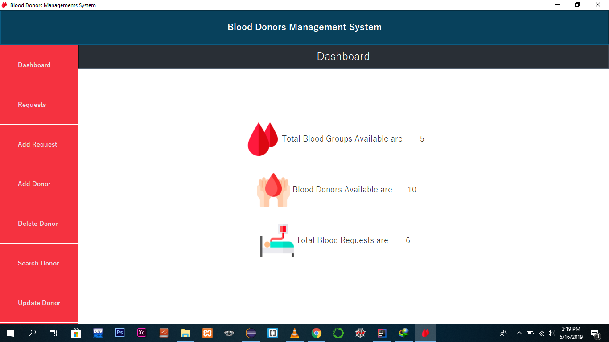
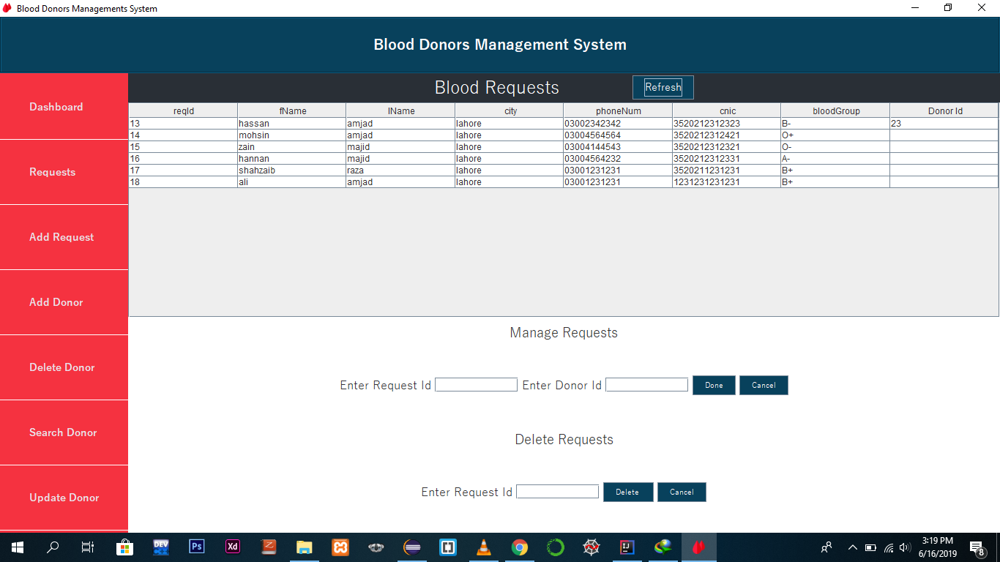
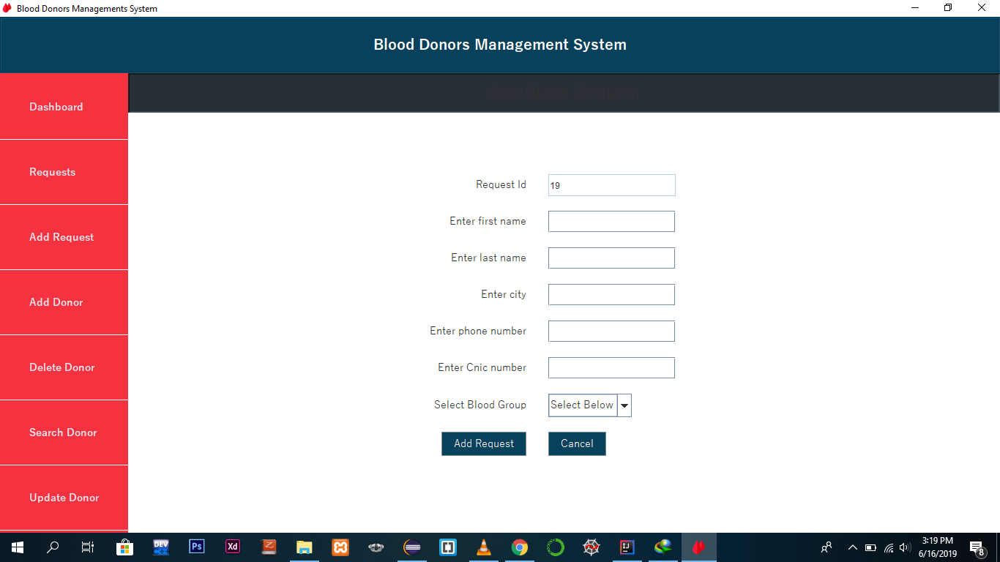
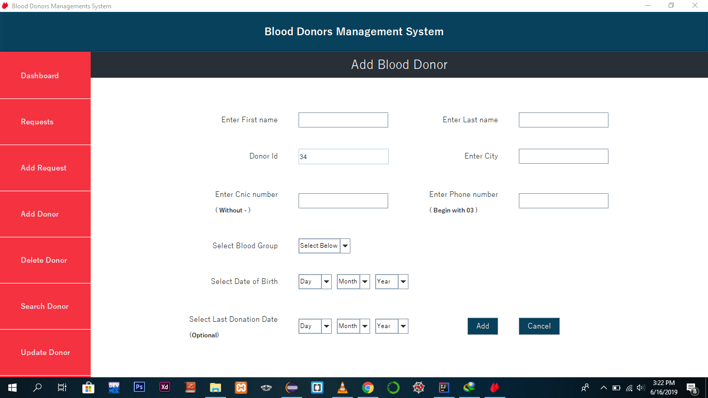
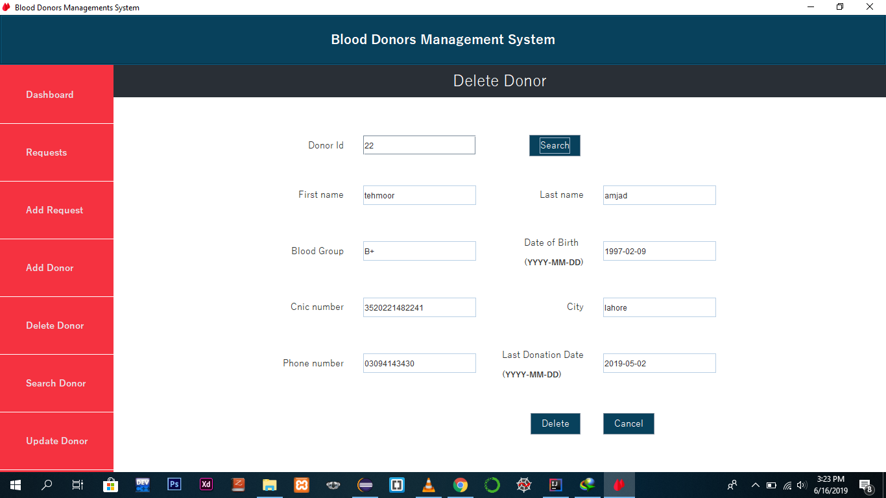
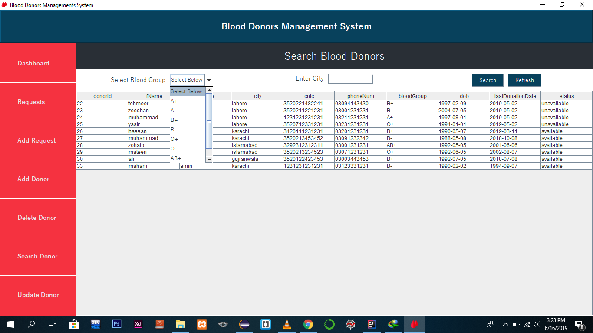
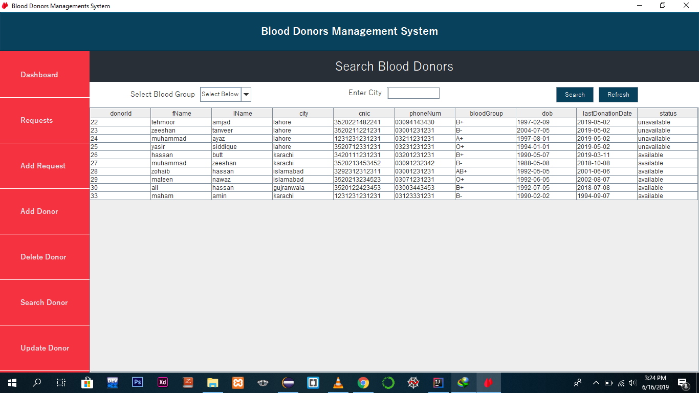
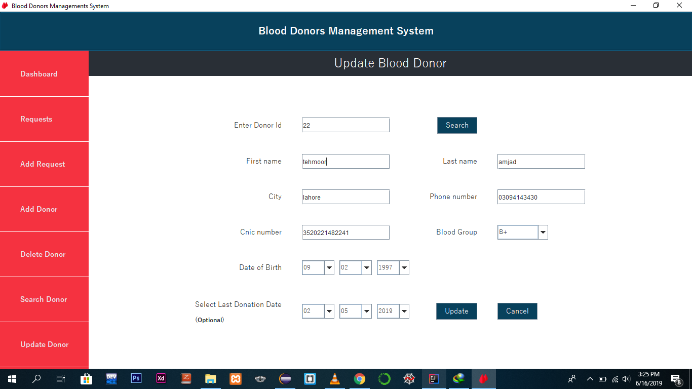

# Blood Donors Management System in JAVA using Swing Framework

# Introduction:
This system is Blood Donors Management System. This is a desktop based user-friendly software which helps the management of organization to manage blood crisis. Only the authorized person can access and manage this system by entering the credentials and Clicking “Log In” Button. New Employee can also Log In by First Creating his new account and then “Log In” the system. 
This software consists of two major sections. One who donate bloods and the second are the ones who requests for blood.
The first section is about the one’s who are willing to donate their bloods, can easily register themselves in list of donors. And other section is request section for bloods. This section is used by people who are willing for blood can easily make their blood requests to our management.

# In Dashboard Section:
In this section, all available blood donors, available blood Groups and blood requests are displayed in respective fields.

# In Add Donor Section:
A blood donor can be register himself as a regular blood donor for blood donations. The status of availability of donor will only be “available” when he had not donated the blood for about 3 months. After 3 months of duration, the status of blood donor will be set to “available”. If the duration is less then 3 months the status of the blood donor will be set to “un-available”. 

# In Update Donor Section:
The details of the donors can be updated in this section if the blood donor migrates to another city or he has changed his phone number.

# In Search Donor Section:
In this section, all available donors are displayed in JTable. Moreover, Admin can search the blood donors based on city or blood Group.

# In Delete Donor Section:
If the blood donor is not more willing to donate blood or is not able to donate blood due to health issues then his status can be set to “un-available” to save the records of the blood donors without removing them from the database.

# In Add Request Section:
A person can register his request for blood by providing the relative information. The information about the blood request is stored in the database.

# In Requests Section:
All blood requests are displayed in the JTable of requests Section. In the Sub menu of this section, there is another menu for managing request. In this section, Blood Requests can be managed by the Admin. Admin serves the blood requests with respective blood donor and city. So, the blood recipient can easily get the desired blood. After serving the particular request, the request is removed from the JTable but keeps storing the record in database by setting the status of the particular record to “served”.  

# Screenshots

